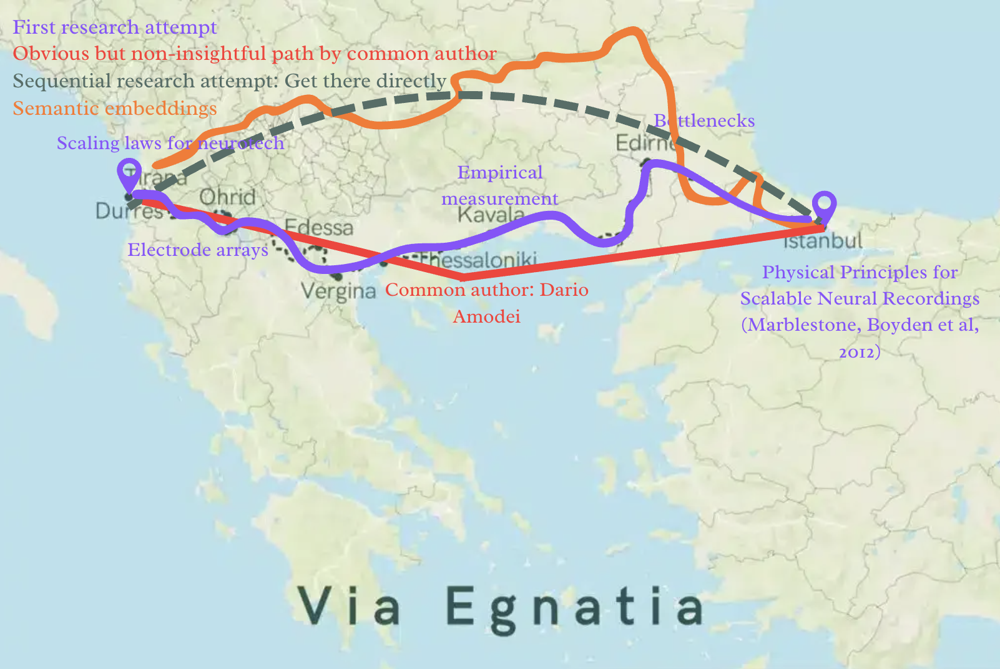

## propagate-yourself
run acoustic simulations on human skulls with less compute, less latency, using better feature representation of the autoresearch process.




## setup
install [uv](https://docs.astral.sh/uv/), then:
```
uv sync
```

install [just](https://github.com/casey/just) for the task recipes (optional, they wrap the commands below):
```
cargo install just
```


## commands

```bash
# ct viewer
uv run python acoustics/view_ct.py

# feynman research-run evaluation
uv run helm-mirror run

# corpus ingest -> postgres (needs DATABASE_URL)
uv run corpus-ingest graphs/corpus/paper-dump.md

# top-5 papers + read/write/execute urges
uv run rwx-policy "focused ultrasound" [--state state.yaml] [--paper-count 5]

# same, with spector2 embedding + pca/hdbscan clustering (needs just sync-graph)
uv run rwx-policy "focused ultrasound" --specter --out-dir graphs/outputs

# test + lint
uv run python -m unittest discover -s tests
uv run ruff check graphs tools tests
```

or via `just`:

```bash
just                    # list recipes
just sync               # uv sync
just sync-graph         # uv sync --group graph (spector2 + scikit-learn)
just ingest             # corpus-ingest graphs/corpus/paper-dump.md
just policy "focused ultrasound"
just run "focused ultrasound"
just test               # unittest discover -s tests
just lint               # ruff check + format --check
```


## quickstart


## tools
1) a simple ct viewer to sanity check downloaded ct in `acoustics/`

`uv run python acoustics/view_ct.py`

keys: `z` axial, `y` coronal, `x` sagittal (key = scrubbed axis)

2) an evaluation tool for feynman research runs. it uses the [stanford helm](https://github.com/stanford-crfm/helm/blob/main/docs/code.md) design. time and token usage are tracked. [more information](tools/helm_mirror/design.md)

`uv run helm-mirror run`

under the `tools/` directory, the problem set lives in `instructions`. you can configure runs in `run_specs.yaml`, evaluation results land in `outputs/`. the extensive feynman artifacts are in its own directory under `autoresearch/runs/`

3) a graph ingestor, differentiator and evaluator

a rough markdown corpus lives at `graphs/corpus/paper-dump.md`. it is parsed,
resolved against openalex, and written to postgres. research taste is written by
hand in `graphs/corpus_ingest/handwritten-policy.md` (heuristics + mental models).

requires `just` and a postgres database with `DATABASE_URL` set.

```bash
just ingest                           # resolve paper-dump.md -> postgres
just policy "focused ultrasound"      # top-5 papers + read/write/execute urges
just run "focused ultrasound"         # ingest, then policy
just test                             # run the test suite
just lint                             # ruff check + format
```

optional specter2 embedding + clustering (install deps first):

```bash
just sync-graph
uv run rwx-policy "focused ultrasound" --specter --out-dir graphs/outputs
```

`--specter` embeds papers and your handwritten policy with `allenai/specter2`,
clusters them (pca + hdbscan), and writes `clusters.json`, `cluster-summary.md`,
and `clusters-2d.png` under `--out-dir`.


## to stop a script
`pkill -f view_ct.py`


## where's your head at??? 
for `1HNA013/ct.mha` from synrad2025 sCT dataset,\
x: 180 - 380\
y: 20 - 320\
z: 55 - 130
